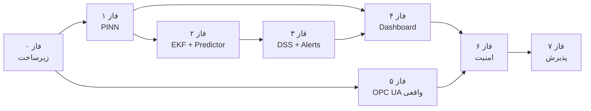

# نقشه راه تکمیل محصول NDT

**سیستم دوقلوی دیجیتال هسته‌ای (Nuclear Digital Twin)**  
**نسخه:** 1.0 · **تاریخ:** ۱۴۰۵/۰۳/۱۵  
**مرجع الزامات:** [README.md](README.md) (SRS v1.0)

---

## خلاصه فازها

| فاز | عنوان | مدت | وضعیت |
|-----|--------|-----|--------|
| **۰** | زیرساخت و pipeline داده | هفته ۱ | 🟡 در حال انجام |
| **۱** | آموزش PINN و inference بلادرنگ | هفته ۲ | ✅ تکمیل |
| **۲** | EKF + Predictor (LSTM-ARIMA) | هفته ۳–۴ | ⬜ |
| **۳** | DSS + Alerts + PostgreSQL | هفته ۵–۶ | ✅ تکمیل |
| **۴** | داشبورد اتاق کنترل | هفته ۷–۸ | ✅ تکمیل |
| **۵** | اتصال I&C واقعی (OPC UA / Modbus) | هفته ۹–۱۰ | ⬜ |
| **۶** | امنیت، ایمنی هسته‌ای، hardening | هفته ۱۱–۱۲ | ⬜ |
| **۷** | کالیبراسیون، آزمون پذیرش، مستندات | هفته ۱۳–۱۶ | ⬜ |

**کل برنامه:** ~۱۶ هفته (۴ ماه) برای MVP قابل استقرار در محیط آزمایشگاه/نیروگاه.

---

## وابستگی‌های بین فازها



---

## فاز ۰ — زیرساخت و pipeline داده (هفته ۱)

**هدف:** کل stack با `docker compose up` بالا بیاید و داده synthetic به InfluxDB برسد.

### کارهای هفته ۱

| # | کار | ID الزام | معیار پذیرش |
|---|-----|----------|-------------|
| 0.1 | کپی و تنظیم `.env` از `.env.example` | NDT-ST-01 | همه سرویس‌ها بدون خطای env بالا می‌آیند |
| 0.2 | `docker compose up -d --build` | NFR-M-01 | ۱۲ container سالم (`docker compose ps`) |
| 0.3 | Health check همه سرویس‌ها | NDT-ST-01 | `GET /health` → 200 از api-gateway |
| 0.4 | اسکریپت `data.py` → Parquet | — | `reactor_synthetic_data_30days.parquet` تولید شود |
| 0.5 | **Pipeline synthetic → InfluxDB** | DI-04 | اسکریپت batch ingest؛ داده ۳۰ روزه در bucket `sensor_data` |
| 0.6 | تأیید OPC UA simulator → data-ingestion | DI-01, NDT-ST-03 | نمونه‌برداری ≥ ۱۰ Hz در InfluxDB قابل مشاهده |
| 0.7 | RabbitMQ + Redis pub/sub بین سرویس‌ها | — | پیام `sensor.data` در صف دیده شود |
| 0.8 | Grafana/Influx UI – داشبورد اولیه داده خام (اختیاری) | — | نمودار temp/pressure/f dnbr |

### تحویل‌دادنی‌ها

```
scripts/ingest_synthetic_to_influx.py   ← pipeline batch
docker compose ps → همه healthy
InfluxDB: ≥ 2.5M نقطه داده (30 روز × 1 Hz × ~20 سنسور)
```

### دستورات

```powershell
.\scripts\ndt.ps1 setup
.\scripts\ndt.ps1 up
pip install -r requirements-dev.txt
python data.py
python scripts/ingest_synthetic_to_influx.py
```

---

## فاز ۱ — آموزش PINN و inference بلادرنگ (هفته ۲)

**هدف:** مدل PINN روی داده synthetic آموزش ببیند و در `pinn-core` بارگذاری شود.

### کارهای هفته ۲

| # | کار | ID الزام | معیار پذیرش |
|---|-----|----------|-------------|
| 1.1 | آماده‌سازی dataset از Parquet | PINN-02 | ورودی/خروجی مطابق SRS (r,θ,z,t + boundary conditions) |
| 1.2 | پیاده‌سازی loss: MSE + NS + Energy + Neutronics | PINN-04, PINN-05 | λ₁=0.1, λ₂=0.1, λ₃=0.01 قابل تنظیم در config |
| 1.3 | آموزش offline (۶ لایه × ۱۲۸ نورون، Swish) | PINN-01 | checkpoint در `models/pinn_reactor_v1.pt` |
| 1.4 | ارزیابی: خطای نسبی دما ≤ ۲٪ | NFR (دقت) | گزارش validation روی hold-out 20% |
| 1.5 | Hot-load در `pinn-core` | NFR-M-04, NDT-ST-02 | بارگذاری از `/app/models/` بدون restart کل stack |
| 1.6 | inference ≤ ۵۰ ms (GPU) / ≤ ۲۰۰ ms (CPU dev) | PINN-06 | لاگ `inference_ms` در Redis |
| 1.7 | heatmap API → frontend | UI-RQ-01 | نقشه ۲۰×۳۰ در داشبورد بروز شود |

### تحویل‌دادنی‌ها

```
training/train_pinn.py
training/dataset.py
training/pinn_loss.py
backend/shared/pinn_model.py
models/pinn_reactor_v1.pt
models/pinn_reactor_v1_metrics.json
backend/pinn_core/main.py  ← بارگذاری وزن + hot-reload
scripts/validate_phase1.py
```

### وضعیت تکمیل (۱۴۰۵/۰۳/۱۵)

| # | کار | وضعیت |
|---|-----|--------|
| 1.1 | Dataset از Parquet | ✅ 23,040 نمونه |
| 1.2 | Physics-informed loss | ✅ |
| 1.3 | Checkpoint آموزش‌دیده | ✅ `models/pinn_reactor_v1.pt` |
| 1.4 | خطای دما ≤ ۲٪ | ✅ **0.22%** |
| 1.5 | Hot-load در pinn-core | ✅ mount + Redis reload API |
| 1.6 | Inference ≤ 200 ms CPU | ✅ **~9 ms** (grid 20×30) |
| 1.7 | Heatmap → frontend | ✅ WebSocket + `/api/v1/reactor/heatmap` |

```powershell
.\scripts\ndt.ps1 train-pinn      # آموزش + اعتبارسنجی
.\scripts\ndt.ps1 validate-phase1 # فقط چک‌های پذیرش
.\scripts\ndt.ps1 up              # اجرای stack با مدل mount‌شده
```

---

## فاز ۲ — EKF + Predictor (هفته ۳–۴)

**هدف:** تطبیق بلادرنگ پارامترهای فیزیکی و پیش‌بینی گذرا.

### هفته ۳ — EKF Adapter

| # | کار | ID الزام | معیار پذیرش |
|---|-----|----------|-------------|
| 2.1 | بردار حالت x = [ε_fuel, R_f, K_spacer, T_out] | AD-01 | state vector در config |
| 2.2 | اندازه‌گیری از سنسورهای دما/فشار | AD-02 | H matrix مطابق نقاط کلیدی |
| 2.3 | به‌روزرسانی هر ۱ ثانیه، ≤ ۲۰ ms | AD-04, AD-05 | benchmark log |
| 2.4 | بافر حلقوی ۱۰۰۰ نمونه + PostgreSQL | AD-06, NDT-SD-01 | جدول `ekf_parameters` پر شود |
| 2.5 | reset در واگرایی (innovation > 3) | AD-07 | تست واحد + سناریوی LOFA |

### هفته ۴ — Predictor (LSTM-ARIMA + سناریو)

| # | کار | ID الزام | معیار پذیرش |
|---|-----|----------|-------------|
| 2.6 | LSTM (50 step, 2 layer) + ARIMA(2,1,2) | FP-01 | مدل روی `roughness_factor` آموزش |
| 2.7 | تشخیص ناهنجاری + trigger transient mode | FP-03, §3.1 | `mode=transient` در Redis |
| 2.8 | شبیه‌سازی ۵۰۰ سناریو ≤ ۱ ثانیه | FP-04, FP-06 | batch GPU؛ fallback CPU ≤ ۵ s در dev |
| 2.9 | خروجی TTE برای DNB و T_clad=620°C | FP-07 | `dnb_tte_distribution` در API |

---

## فاز ۳ — DSS + Alerts (هفته ۵–۶)

**هدف:** سیستم پشتیبان تصمیم و هشدارهای چندسطحی عملیاتی شوند.

### هفته ۵ — DSS

| # | کار | ID الزام | معیار پذیرش |
|---|-----|----------|-------------|
| 3.1 | NSGA-II با جمعیت ۱۰۰ | DSS-03 | pymoo/deap |
| 3.2 | سه تابع هدف + متغیرهای تصمیم | DSS-01, DSS-02 | Pareto front ≤ ۱۰ راهکار |
| 3.3 | رتبه‌بندی «امنیت-اول» + ۳ توصیه برتر | DSS-06, DSS-07 | API `/api/v1/dss/recommendations` |
| 3.4 | زمان بهینه‌سازی ≤ ۵۰۰ ms | DSS-04 | profiling |
| 3.5 | ثبت توصیه‌ها در PostgreSQL | SAF-05 | جدول `dss_recommendations` |

### هفته ۶ — Alerts

| # | کار | ID الزام | معیار پذیرش |
|---|-----|----------|-------------|
| 3.6 | هشدار قرمز/نارنجی/زرد/آبی | AL-01–AL-04 | ۴ سطح در UI |
| 3.7 | TTE + NTP timestamp | AL-05, UI-RQ-04 | `tte_sec` در payload |
| 3.8 | Snooze ۵ دقیقه | AL-06 | endpoint + UI |
| 3.9 | Cut sensor → Safe Mode | DI-03, §3.1 | بعد از ۳ s قطعی |

---

## فاز ۴ — داشبورد اتاق کنترل (هفته ۷–۸)

**هدف:** UI production-ready مطابق UI-RQ-01 تا UI-RQ-11.

| # | کار | ID الزام | معیار پذیرش |
|---|-----|----------|-------------|
| 4.1 | Heatmap تعاملی (r,θ,z) | UI-RQ-01 | بروزرسانی ≤ ۲۰۰ ms via WebSocket |
| 4.2 | DNBR, TTE, پارامترهای کلیدی | UI-RQ-02, UI-RQ-03, UI-RQ-04 | |
| 4.3 | کارت‌های DSS + تأیید دو مرحله‌ای | UI-RQ-05, UI-RQ-06, SAF-01 | بدون ارسال خودکار به PLC |
| 4.4 | Dark mode | UI-RQ-07 | toggle پایدار |
| 4.5 | صفحه تنظیمات (آستانه‌ها، PINN reload) | UI-RQ-08–UI-RQ-11 | route `/settings` |
| 4.6 | Export CSV/Parquet | API-RQ-03 | دانلود ۲۴ h تاریخچه |
| 4.7 | OpenAPI 3.0 کامل | NFR-M-02 | `/docs` + `openapi.json` |

### وضعیت تکمیل (۱۴۰۵/۰۳/۱۵)

| # | کار | وضعیت |
|---|-----|--------|
| 4.1 | Heatmap تعاملی + WebSocket 200ms | ✅ `Heatmap.tsx` + WS payload |
| 4.2 | DNBR, TTE, پارامترها | ✅ Dashboard metrics |
| 4.3 | DSS + تأیید دو مرحله‌ای | ✅ Modal 2-step (SAF-01) |
| 4.4 | Dark mode | ✅ `useTheme` + localStorage |
| 4.5 | `/settings` | ✅ thresholds, PINN, log |
| 4.6 | Export CSV/Parquet | ✅ `/api/v1/export/download` |
| 4.7 | OpenAPI tags | ✅ `/docs` |

```powershell
.\scripts\ndt.ps1 validate-phase4
cd frontend && npm install && npm run dev
```

---

## فاز ۵ — اتصال I&C واقعی (هفته ۹–۱۰)

**هدف:** جایگزینی simulator با PLC نیروگاه.

| # | کار | ID الزام | معیار پذیرش |
|---|-----|----------|-------------|
| 5.1 | OPC UA Client production (TLS, cert) | HW-RQ-01, SEC-02 | اتصال به gateway واقعی |
| 5.2 | Modbus TCP fallback | HW-RQ-02 | switch در config |
| 5.3 | ایزولاسیون شبکه / VLAN | HW-RQ-03, SEC-03 | مستند topology |
| 5.4 | نرخ نمونه‌برداری ۱–۱۰۰ Hz | HW-RQ-05 | runtime config |
| 5.5 | تأیید min/max سنسور قبل از normal op | NDT-ST-04 | startup checklist |

---

## فاز ۶ — امنیت و hardening (هفته ۱۱–۱۲)

| # | کار | ID الزام | معیار پذیرش |
|---|-----|----------|-------------|
| 6.1 | TLS 1.3 (nginx + inter-service) | SEC-02 | HTTPS روی :443 |
| 6.2 | 2FA (PIN + smart card placeholder) | SEC-01 | login flow |
| 6.3 | Vault برای secrets | SEC-05 | بدون password در .env prod |
| 6.4 | Audit log + WORM storage | SAF-05, SEC-04 | append-only |
| 6.5 | Failover Active-Passive | NFR-R-04 | ≤ ۱ s switch |
| 6.6 | تأیید سه‌گانه DSS | SAF-02, SAF-03 | anomaly + expert + RELAP5 stub |
| 6.7 | کلید سخت‌افزاری قطع DSS | SAF-04 | مستند + API disable |

---

## فاز ۷ — کالیبراسیون، آزمون، تحویل (هفته ۱۳–۱۶)

### هفته ۱۳–۱۴ — کالیبراسیون (§3.1 Calibration Mode)

| # | کار | ID الزام | معیار پذیرش |
|---|-----|----------|-------------|
| 7.1 | ۷ روز داده واقعی → EKF init | §3.1 | پارامترهای اولیه پایدار |
| 7.2 | Fine-tune PINN روی داده واقعی | — | خطای دما ≤ ۲٪ |
| 7.3 | تنظیم آستانه‌های ایمنی توسط مهندس | UI-RQ-08 | config persist |

### هفته ۱۵ — آزمون پذیرش

| دسته | تست | معیار |
|------|-----|--------|
| عملکرد | End-to-end latency | ≤ ۵۰۰ ms (NFR-P-01) |
| عملکرد | ۵۰۰ سناریو | ≤ ۱ s (FP-06) |
| قابلیت اطمینان | Availability | ≥ ۹۹.۹۵٪ (NFR-R-03) |
| ایمنی | SAF-01 | هیچ دستور خودکار به PLC |
| راه‌اندازی | Cold start | ≤ ۲ min (NDT-ST-01) |
| خاموشی | Snapshot + گزارش ۲۴ h | NDT-SD-01–03 |

### هفته ۱۶ — مستندات تحویل

- [ ] ماتریس ردیابی الزامات (§8.2) — هر ID → کد + تست
- [ ] راهنمای استقرار (Ubuntu 22.04 + GPU)
- [ ] راهنمای اپراتor اتاق کنترل
- [ ] گزارش آموزش PINN + validation metrics
- [ ] سناریوهای آزمون LOFA / LOCA / DNB

---

## بک‌لاگ GitHub Issues (پیشنهاد برچسب‌ها)

| برچسب | کاربرد |
|--------|--------|
| `phase-0` … `phase-7` | فاز |
| `srs:DI-01` … `srs:SAF-05` | ID الزام |
| `priority:critical` | حیاتی (PINN, EKF, SAF) |
| `priority:high` | بالا (DSS, Predictor, UI) |
| `type:infra` / `type:ml` / `type:ui` / `type:security` | نوع کار |

### نمونه Issue

```
Title: [phase-0] Pipeline synthetic → InfluxDB
Labels: phase-0, srs:DI-04, type:infra, priority:high
Acceptance:
  - scripts/ingest_synthetic_to_influx.py exists
  - 30 days of data in bucket sensor_data
  - Query returns > 2M points
```

---

## ریسک‌ها و mitigation

| ریسک | احتمال | تأثیر | اقدام |
|------|--------|-------|-------|
| نبود GPU در dev | بالا | متوسط | CPU fallback + cloud GPU برای training |
| دسترسی به PLC واقعی دیر | متوسط | بالا | OPC UA simulator تا فاز ۵ |
| خطای PINN > ۲٪ | متوسط | بالا | augment با RELAP5 + بیشتر λ tuning |
| latency > ۵۰۰ ms | پایین | بالا | profiling + Redis cache + batch inference |

---

## تعریف «محصول تکمیل‌شده» (Definition of Done)

محصول زمانی **تکمیل** محسوب می‌شود که:

1. تمام IDهای **حیاتی** ماتریس §8.2 پوشش داده شده باشند.
2. `docker compose up` در محیط تأییدشده §8.3 بدون خطا اجرا شود.
3. سناریوی LOFA در demo end-to-end (سنسور → PINN → EKF → Predictor → DSS → UI) قابل نمایش باشد.
4. SAF-01 تا SAF-05 در ممیزی ایمنی پاس شوند.
5. مستندات استقرار و اپراتor تحویل داده شده باشد.

---

*برای به‌روزرسانی وضعیت فازها، ستون «وضعیت» در جدول خلاصه را ویرایش کنید.*
